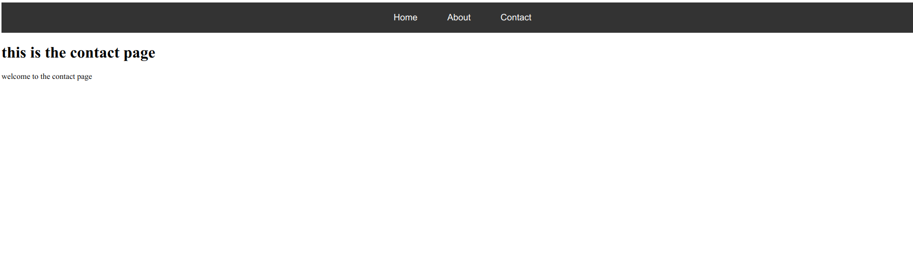

# state management
using hash events to manage state on the navigation

# NOTE!!
in future ill upgrade to vue routing ,,thi only applies because its a simple state management between the na components

# UI
