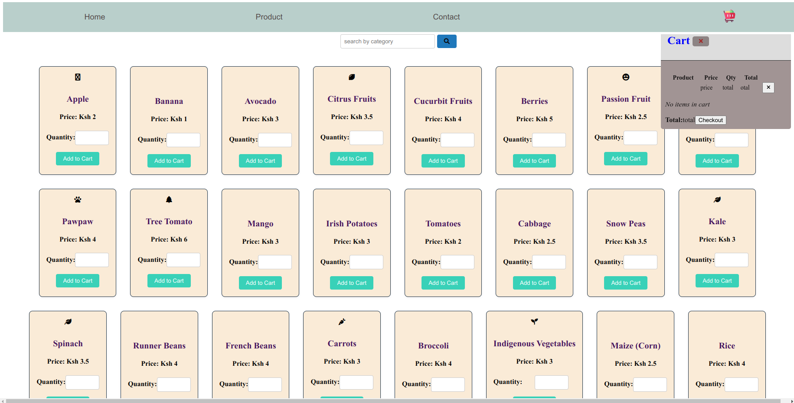

# vendor app
it is a web app that offers online market for fruits, veges and cereals

# UI

# key  concepts
1.state management of nav links using hash function
2.listing of products using v-for directive
3.components(registration,props,events,v-modeling)
  a.home component
  b.products component
  c.contact component
  d.cart component
4.

# Goals
1.nav links management using vue routing
2.API intergration for check out functionality
3.mobile App()